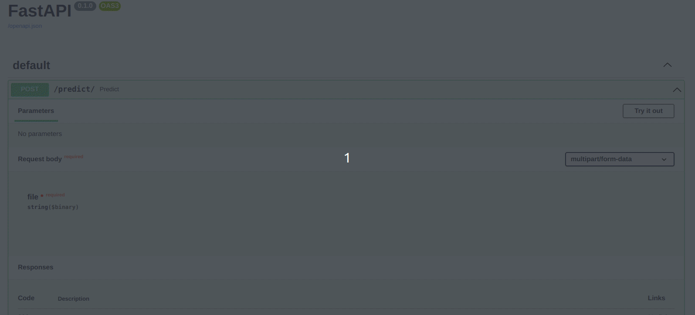
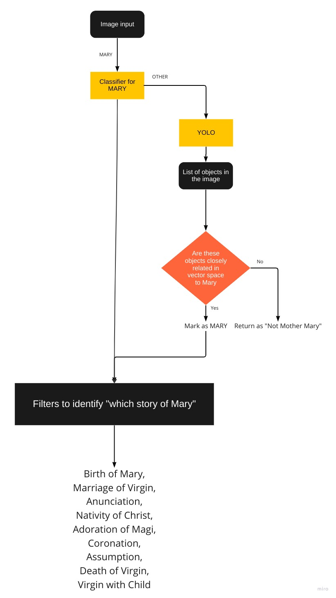

# Christian-Iconography-API
An API for predicting the "story" of Mother Mary. This repository is a built on the work done by Parth Shukla in Google Summer of Code'22. [Link](https://parths28.github.io/emilemale.github.io/)

## How to use

Run
`docker build -t  .` and then
`docker run -p 80:80 iconography-api`

Or 

Create a virtual environment using `virtualenv venv` and activate it using `source venv/bin/activate`

Download requirements using `pip install -r requirements.txt` and then `cd app` where you run `uvicorn main:app --reload`

After that you can go to `http://127.0.0.1:8000/docs` to see the swagger UI and test the API. 

## What does it do

Note: If model does not think it is Mother Mary, it simply returns 0 for all the classes.

